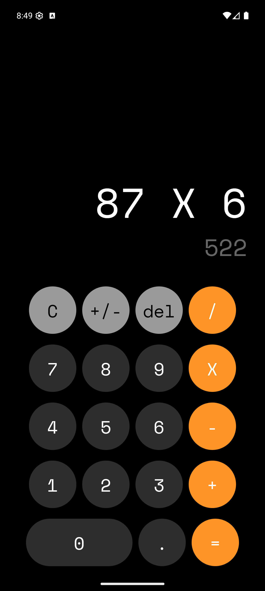

# Calculadora React Native

Esta es una aplicación de calculadora básica desarrollada con **React Native**. Permite realizar operaciones matemáticas simples como suma, resta, multiplicación y división.

## 🛠️ Tecnologías utilizadas

- React Native
- Expo
- JavaScript
- Hooks (useState, useEffect, useRef)

## 📱 Funcionalidades

- Interfaz de usuario simple y amigable
- Botones numéricos y de operaciones
- Evaluación de expresiones matemáticas
- Mostrar resultado parcial a medida que se escribe

## 🖼️ Capturas de pantalla

 

## ⚙️ Instalación y ejecución

1. Clonar el repositorio:

```bash
git clone https://github.com/SebasRomero97/03--RN--calculator-app.git
```

2. Instalar dependencias:

```bash
npm install
```

3. Iniciar la aplicación con Expo:

```bash
npx expo start
```

Escaneá el código QR con la app de Expo Go en tu celular para probarla.


## 🧠 Aprendizajes

- Manejo de estado con `useState`
- Reacciones a cambios con `useEffect`
- Optimización del render con `useRef`
- Lógica para interpretación de fórmulas
